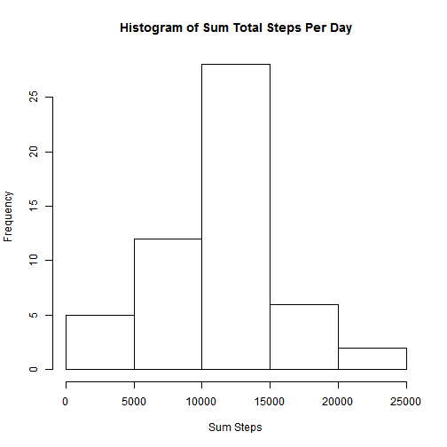
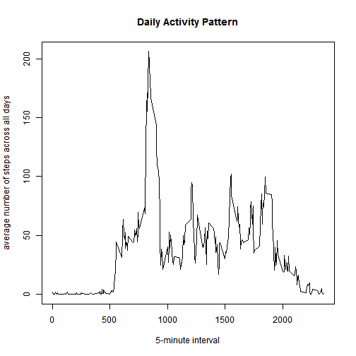
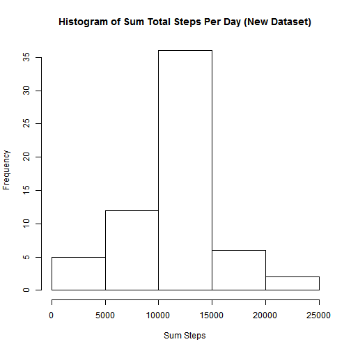
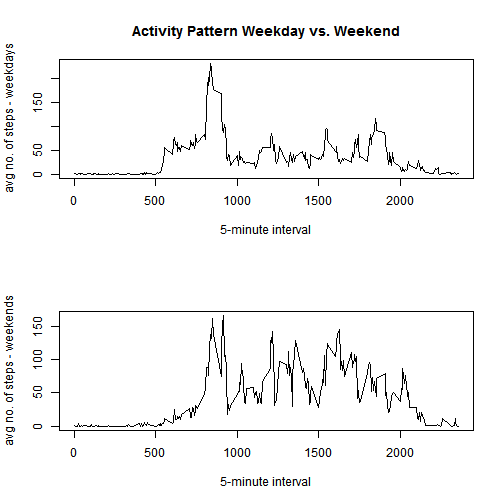

Reproducible Research Peer Assignment 1
========================================================

Load data into R


```r
myData <- read.csv("repdata_data_activity/activity.csv", header = TRUE)
head(myData)
```

```
##   steps       date interval
## 1    NA 2012-10-01        0
## 2    NA 2012-10-01        5
## 3    NA 2012-10-01       10
## 4    NA 2012-10-01       15
## 5    NA 2012-10-01       20
## 6    NA 2012-10-01       25
```


1. What is mean total number of steps taken per day?
a. make histogram of total number of steps taken per day
First I reshape the date using reshape 2 package using date as an id variable and steps as a measure variable


```r
library(reshape2)
newData <- subset(myData, complete.cases(myData$steps))
dataMelt <- melt(newData, id = c("date", "interval"), measure.vars = "steps")
sumStep <- dcast(dataMelt, date ~ variable, fun.aggregate = sum)
head(sumStep)
```

```
##         date steps
## 1 2012-10-02   126
## 2 2012-10-03 11352
## 3 2012-10-04 12116
## 4 2012-10-05 13294
## 5 2012-10-06 15420
## 6 2012-10-07 11015
```

```r
hist(sumStep$steps, main = "Histogram of Sum Total Steps Per Day", xlab = "Sum Steps")
```

 


b. Calculate and report the mean and median total number of steps taken per day


```r
meanTotal <- mean(sumStep$steps)
medianTotal <- median(sumStep$steps)
result <- cbind(meanTotal, medianTotal)
print(result)
```

```
##      meanTotal medianTotal
## [1,]     10766       10765
```


2. What is the average daily activity pattern?
a. time series plot


```r
interval_cast <- dcast(dataMelt, interval ~ variable, fun.aggregate = mean)
plot(interval_cast$interval, interval_cast$steps, type = "l", xlab = "5-minute interval", 
    ylab = "average number of steps across all days", main = "Daily Activity Pattern")
```

 


Using subset to find the value of 5-min interval contains the maximum numbers of steps


```r
subset(interval_cast, interval_cast$steps == max(interval_cast$steps))
```

```
##     interval steps
## 104      835 206.2
```


3. Imputing missing values
Total number of missing value

```r
sum(is.na(myData$steps))
```

```
## [1] 2304
```


To deal with NAs, one strategy is to replace all with the mean steps for the 
respective 5-min interval
The solution here is to use melt function in the reshape2 package to melt the
data with "date" and "interval" as id variables and ddply function in the plyr
package to apply the replacing NA function to each group of 5-min interval.
Finally, dcast function will return to the data with the original format.
The final dataset with NA valued filled is shown below:

```r
library(reshape2)
library(plyr)
dataMelt1 <- melt(myData, id = c("date", "interval"), measure.vars = "steps")
newData <- ddply(dataMelt1, "interval", function(x) {
    x$value[is.na(x$value)] <- mean(x$value, na.rm = TRUE)
    return(x)
})
newData <- dcast(newData, date + interval ~ variable)
head(newData)
```

```
##         date interval   steps
## 1 2012-10-01        0 1.71698
## 2 2012-10-01        5 0.33962
## 3 2012-10-01       10 0.13208
## 4 2012-10-01       15 0.15094
## 5 2012-10-01       20 0.07547
## 6 2012-10-01       25 2.09434
```


Based on the new dataset, a new histogram is generated using the same method as in the task 1


```r
dataMelt1 <- melt(newData, id = c("date", "interval"), measure.vars = "steps")
sumStep1 <- dcast(dataMelt1, date ~ variable, fun.aggregate = sum)
hist(sumStep1$steps, main = "Histogram of Sum Total Steps Per Day (New Dataset)", 
    xlab = "Sum Steps")
```

 


And we have mean and median for the total numbers of steps 

```r
meanTotal1 <- mean(sumStep1$steps)
medianTotal1 <- median(sumStep1$steps)
result1 <- data.frame(mean_total_steps = meanTotal1, median_total_steps = medianTotal1)
print(result1)
```

```
##   mean_total_steps median_total_steps
## 1            10766              10766
```


Comparing the result here and the ones in the task 1, there is no significant difference between the two. The mean remains the same whereas the median is slightly greater in the new dataset compared to the first one.

Hence, there is no impact when filling the NA values with the mean of the respective 5-min interval

4. weekdays vs. weekends

Firstly, we create a dataset with new variable containing 2 factors "weekday" and "weekend" by first convert the "date" variable from character to date.
We then use weekdays() function to find which day the date belongs to.
Finally we subset "Saturday" and "Sunday" by "weekend" and the rest by "weekday" to generate a new dataset called "newData
"

```r
newData$date <- as.Date(newData$date)
newData$date <- weekdays(newData$date)
wd <- newData$date == "Saturday" | newData$date == "Sunday"
newData$date[wd] <- "weekend"
newData$date[!wd] <- "weekday"
head(newData)
```

```
##      date interval   steps
## 1 weekday        0 1.71698
## 2 weekday        5 0.33962
## 3 weekday       10 0.13208
## 4 weekday       15 0.15094
## 5 weekday       20 0.07547
## 6 weekday       25 2.09434
```


I then dcast the newData and split it into 2 groups weekday and weekend in order to plot the time series for both.


```r
wdData1 <- melt(newData, id = c("interval", "date"), measure.vars = "steps")
wd_cast <- dcast(wdData1, interval + date ~ variable, fun.aggregate = mean)
head(wd_cast)
```

```
##   interval    date   steps
## 1        0 weekday 2.25115
## 2        0 weekend 0.21462
## 3        5 weekday 0.44528
## 4        5 weekend 0.04245
## 5       10 weekday 0.17317
## 6       10 weekend 0.01651
```

```r
wd_cast <- split(wd_cast, wd_cast$date)
wDays <- wd_cast[["weekday"]]
wEnds <- wd_cast[["weekend"]]
par(mfrow = c(2, 1))
plot(wDays$interval, wDays$steps, type = "l", xlab = "5-minute interval", ylab = "avg no. of steps - weekdays", 
    main = "Activity Pattern Weekday vs. Weekend")
plot(wEnds$interval, wEnds$steps, type = "l", xlab = "5-minute interval", ylab = "avg no. of steps - weekends")
```

 


Comparing the 2 plots, there seems to have no significant difference between the two. The plot for weekend seems to be more fluctuating compared to the one for weekday. 
